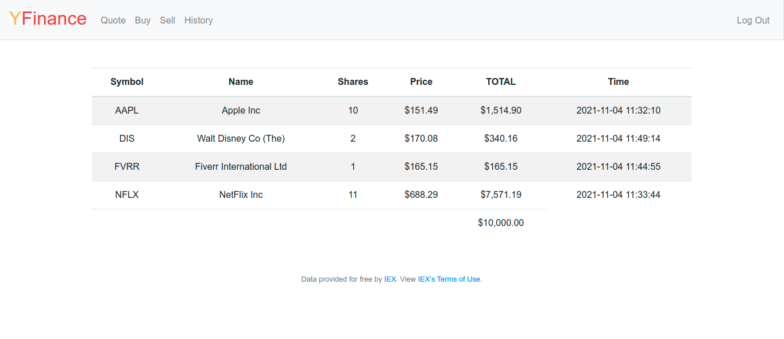
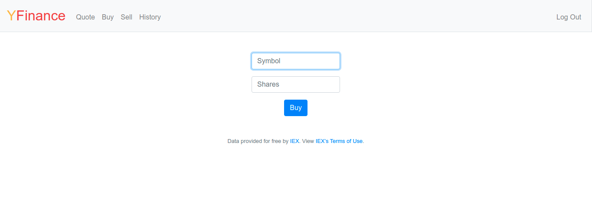
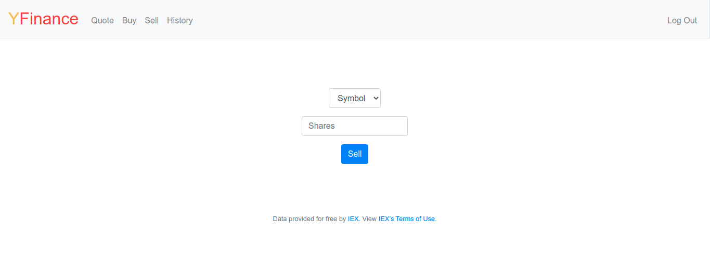
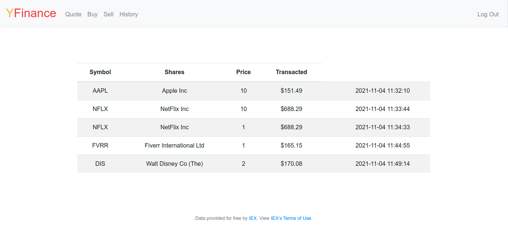

# []() []() []()
# YFinance
Its a Platform where you can manage selling, buying, and checking stock prices

## Features

- Buy stocks
- Sell stocks
- Lookup stocks

# Dashboard Page


# Buy Page


# Sell Page


# History Page


## Deployment

To Install all the Dependencies required for the Project

```bash
  pip install -r requirements.txt
```

To get the Api Key

Visit iexcloud.io/cloud-login#/register/.

Select the “Individual” account type, then enter your email address and a password, and click “Create account”.

Once registered, scroll down to “Get started for free” and click “Select Start” to choose the free plan.

Once you’ve confirmed your account via a confirmation email, visit https://iexcloud.io/console/tokens.

Copy the key that appears under the Token column (it should begin with pk_).

To deploy this project run

```bash
  export API_KEY=value
```

Run the Project

```bash
  flask run
```